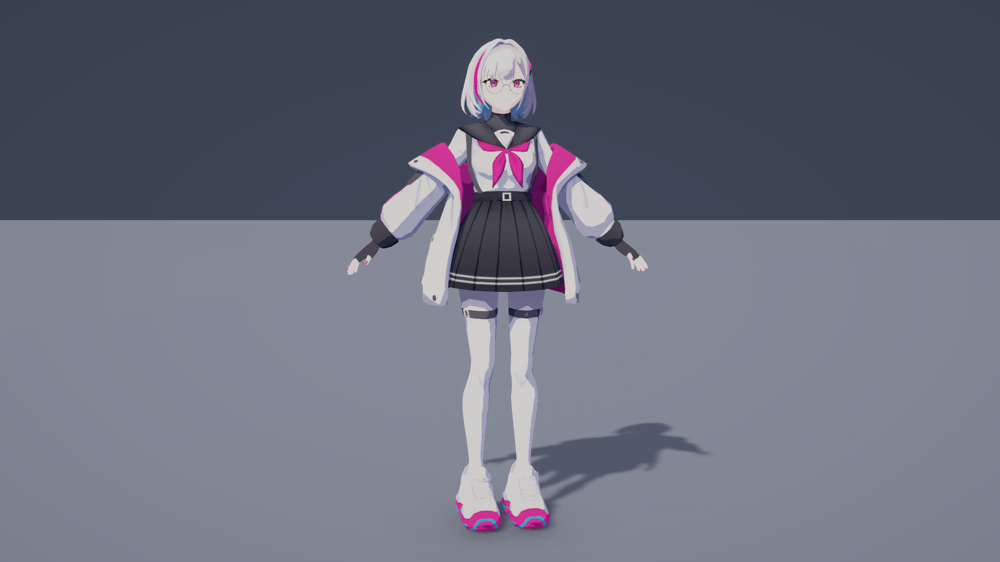
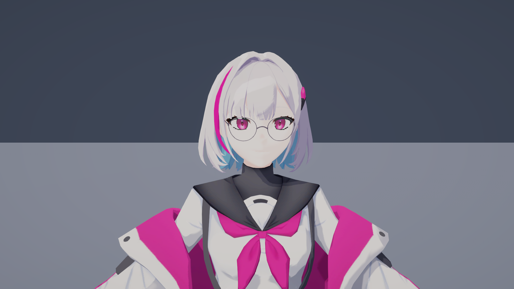

# 푸시아 부위별 툰 쉐이딩 테스트

- 씬: `Assets/CK_Semester_Project/Prototype/Scenes/FuchsiaShadowTest.unity`
- 자산 루트: `Assets/CK_Semester_Project/Prototype/Sandbox/Junmo/FuchsiaShading/`
- 셰이더: 자산 루트의 `Shaders/`에 있는 부위별 셰이더 5종. 음영 공통 함수는 `FuchsiaToonCommon.hlsl`에서 관리한다.
- 씬과 `Prefabs/FuchsiaToon.prefab`의 렌더러 35개를 머티리얼 14개로 분리했다.

## 부위별 설정

| 부위 | 머티리얼 | 셰이더 | 조절할 표현 |
|---|---|---|---|
| 겉머리·뒷머리·앞머리·옆머리 | FuchsiaHairToon | Hair Toon | 결 방향의 띠 광택, 가장자리 빛, 3단계 명암 |
| 얼굴·눈썹·속눈썹·입 | FuchsiaFaceToon | Face Toon | 따뜻한 음영색, 얼굴의 그림자 강도 |
| 눈동자·눈 하이라이트 | FuchsiaEyesToon | Face Toon | 그림자 수신 0, 툰 음영 강도 0.15로 눈 색 유지 |
| 손 | FuchsiaHandsToon | Face Toon | 얼굴과 독립된 피부 음영, 의상2 텍스처 사용 |
| 몸·벨트끈 | FuchsiaOutfit01Toon | Cloth Toon | 옷의 명암 경계와 색 |
| 외투 | FuchsiaCoatToon | Cloth Toon | 주름의 선명한 음영 경계 |
| 치마 | FuchsiaSkirtToon | Cloth Toon | 검은 옷의 어두운 음영색 |
| 다리 | FuchsiaOutfit02Toon | Cloth Toon | 다리·스타킹 메시의 음영 |
| 리본 | FuchsiaRibbonToon | Cloth Toon | 리본의 색과 명암 |
| 신발·신발끈 | FuchsiaShoesToon | Cloth Toon | 신발 음영 |
| 안경테 | FuchsiaGlassesFrameToon | Accessory Toon | 작은 단계형 광택, 테두리 빛 |
| 머리핀 | FuchsiaHairpinToon | Accessory Toon | 머리와 독립된 광택 |
| 단추 | FuchsiaButtonsToon | Accessory Toon | 옷과 독립된 광택 |
| 안경알 | FuchsiaGlassesLens | Lens Toon | 투명도, 테두리 반사, 작은 광택 |

## Inspector 조절 방법

1. 원하는 부위를 선택하고 Renderer의 머티리얼을 펼치거나 `Materials/`에서 해당 머티리얼을 선택한다.
2. `First shade tint`, `Deep shade tint`, `Light / shade boundary`, `Deep shade boundary`, `Boundary softness`로 툰 명암을 조절한다.
3. `Received shadow strength`는 실시간 그림자 수신 강도, `Toon shading strength`는 명암색 적용 강도다. 얼굴에는 그림자 수신 강도 0.20과 툰 음영 강도 0.65를 기본 적용했다.
4. 머리·안경테·머리핀·단추의 `Highlight strength`, `Highlight band size`, `Highlight softness`로 광택을 조절한다. `Rim strength`, `Rim power`는 가장자리 빛이다.
5. 렌즈의 `Lens opacity`는 전체 투명도, `Edge opacity`와 `Edge power`는 테두리 반사, `Highlight strength`는 반사 광택이다. 렌즈는 투명 정렬·깊이 쓰기 Off로 설정하고 그림자를 투사하지 않는다.
6. `KeyLight_AdjustRotation` Rotation X/Y를 변경해 광원 높이·방향을 조절한다. 기본값은 (42, -145, 0), Intensity 1, Shadow Strength 0.85다.
7. `FaceDetailCamera`의 미리보기로 얼굴을 확인한다. Game 화면에서 확대하려면 Main Camera를 비활성화하고 FaceDetailCamera를 활성화한다.

원본 텍스처에 그려진 주름·머리카락 명암은 유지했다. 그려진 그림자는 광원과 함께 움직이지 않는다. 셰이더는 주광원에 반응하며 Point/Spot 추가 광원은 계산하지 않는다. 별도 얼굴 SDF 맵은 제공되지 않았으므로 Face Toon은 메시 노멀을 이용한다. 의상 알파 TGA는 보관하지만 불투명 옷 머티리얼에는 연결하지 않았다.

## 현재 표현 조정

광원과 카메라는 유지하고 옷·머리·얼굴의 표현을 다듬었다.

- 옷: 음영색의 보라색 채도를 낮췄다. 일반 음영 경계 0.57(치마 0.53), 깊은 음영 경계 0.24, 경계 부드러움 0.035로 주름을 유지하면서 경계의 거친 느낌을 완화했다.
- 공통 명암: 화면 픽셀 크기(`fwidth`)를 고려해 픽셀보다 얇은 경계에서 발생하는 계단 현상을 완화했다.
- 머리: 옆머리의 깊은 보라색 음영을 밝게 하고, 광택 폭 0.008·부드러움 0.002·강도 0.18로 좁은 띠 광택을 적용했다. 테두리 빛은 0.035다.
- 얼굴: 밝은 피부색에 얕은 따뜻한 음영을 적용했다. 음영 경계 0.58, 부드러움 0.10, 툰 음영 강도 0.65, 그림자 수신 강도 0.20이다. 코 옆·볼·턱 주변은 메시 노멀로 표현하며 눈은 독립 머티리얼의 밝기를 유지한다.
- 안경테·렌즈는 앞서 조정한 기본값을 유지했다.

같은 광원·카메라로 촬영한 비교 화면:

## 확인 결과

- 부위별 셰이더 5종 컴파일 오류·경고 없음.
- 씬 및 프리팹의 렌더러 35개에 부위별 머티리얼 연결 확인. 텍스처 누락 없음.
- 전신·얼굴 근접 화면, 투명 렌즈 및 역광 (25, 35, 0) 렌더 확인 후 기본 조명 복원.
- Unity Console 오류·경고 없음. Play 모드 검증은 수행하지 않았다.

