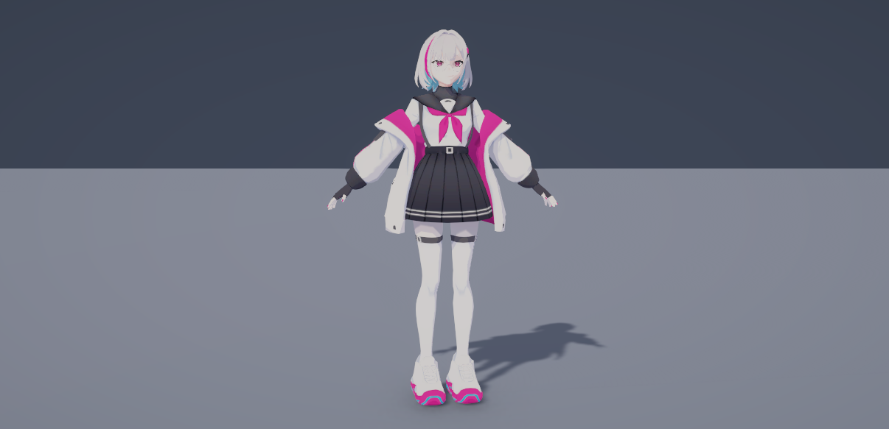

# 푸시아 그림자·쉐이딩 테스트

- 씬: `Assets/CK_Semester_Project/Prototype/Scenes/FuchsiaShadowTest.unity`
- 모델·머티리얼·프리팹·텍스처: `Assets/CK_Semester_Project/Prototype/Sandbox/Junmo/FuchsiaShading/`
- 셰이더: 기존 `Semester/Character Toon`. 셰이더 소스 및 프로젝트 공통 렌더링 설정은 수정하지 않았다.

## 조절 방법

1. 씬의 `KeyLight_AdjustRotation` Rotation X/Y를 변경해 광원 높이와 방향을 조절한다. 기본값은 (42, -145, 0), Intensity 1, Shadow Strength 0.85다.
2. `FuchsiaHairToon`, `FuchsiaFaceToon`, `FuchsiaOutfit01Toon`, `FuchsiaOutfit02Toon`의 First shade tint, Deep shade tint, Light / shade boundary를 조절한다.
3. 얼굴 확대는 `FaceDetailCamera`를 선택해 카메라 미리보기로 확인한다. Game 화면에서 확대하려면 Main Camera를 비활성화하고 FaceDetailCamera를 활성화한다.

텍스처에 이미 그려진 주름·머리카락 명암을 살리기 위해 실시간 음영의 색 차이를 약하게 설정했다. 얼굴은 별도의 따뜻한 음영색과 낮은 경계값으로 설정했다. 셰이더는 주광원에 반응하므로 추가 Point/Spot Light의 효과를 기대하지 않는다.

안경알은 기존 셰이더가 불투명 전용이므로 별도 URP/Lit 투명 머티리얼을 사용하며 그림자를 투사하지 않는다. 나머지 34개 렌더러는 기존 Toon 셰이더를 사용한다. 얇은 의상·머리 메시의 안쪽도 보이도록 Cull Off 및 양면 그림자 투사를 설정했다. 제공된 의상 알파 TGA는 함께 보관했으나 현재 불투명 Toon 머티리얼에는 연결하지 않았다.

## 확인 결과

- FBX의 렌더러 35개 배치, 4종 텍스처 연결 확인.
- 전신·얼굴 확대 렌더 확인.
- 역광 (25, 35, 0)에서 모델 명암 및 바닥 그림자 방향 변화 확인 후 기본 조명 복원.
- 기존 Toon 셰이더 오류 없음. Play 모드 검증은 수행하지 않음.
- 원본 모델의 텍스처에 그려진 그림자는 광원 방향과 함께 움직이지 않는다.

