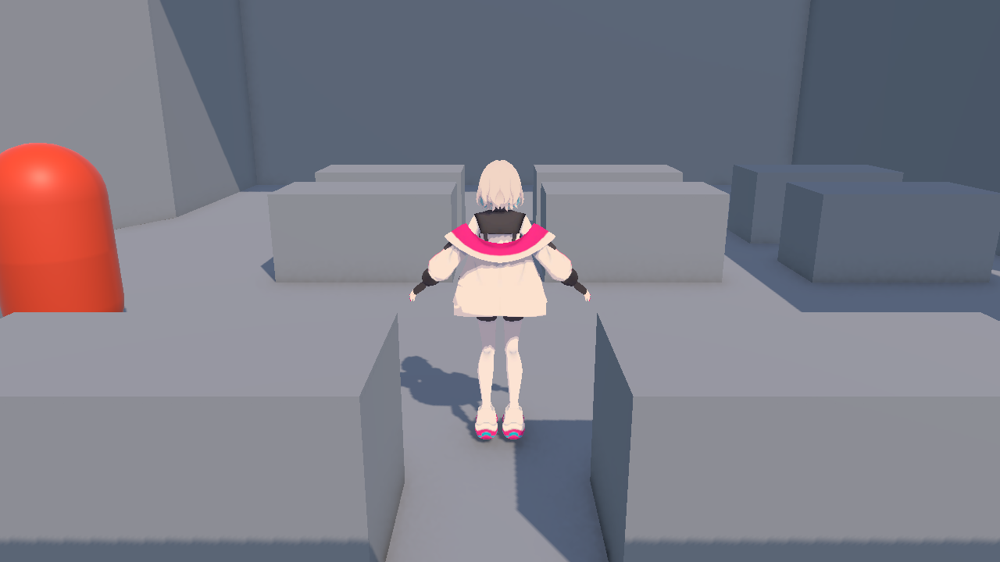
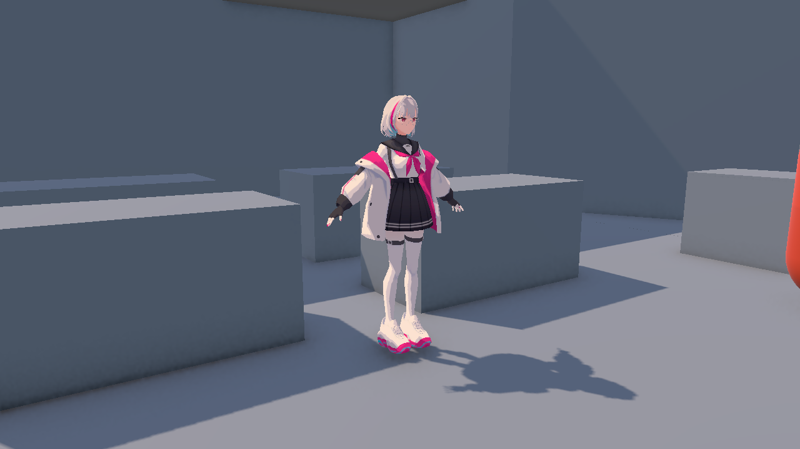

# 그레이박싱 맵 · 푸시아 이동 통합

실행 씬: `Assets/CK_Semester_Project/Prototype/Scenes/MapGrayboxingFuchsia.unity`

## 출처

- 배경: `dkdm9/CK_Semester_project`, `Map_Grayboxing`, `77ee56e8368f954a7bb2f5d74fb42849f2abe5c3`의 `Assets/CK_Semester_Project/Scenes/SampleScene.unity`.
- 이동·카메라: `origin/prototype`의 `TutorialDemo`, `PlayerMovement`, `CameraController`. 카메라 컴포넌트와 Inspector 설정을 복제하고 추적 대상을 푸시아로 연결했다.
- 캐릭터: `test/prototype-model-shadow-light`의 `FuchsiaToon.prefab`. 기존 텍스처·툰 머티리얼·투명 안경알·그림자 설정을 유지했다.

포크의 `Assets/Map_Grayboxing.unity`에는 카메라와 광원만 있다. 실제 배경 모델링은 위 `Scenes/SampleScene.unity`에 있다. 원본 배경 씬을 보관하고 별도 통합 씬을 생성한다. 배경 편집에는 ProBuilder 6.1.2가 필요하며 패키지 의존성에 추가했다.

## 조작과 구성

- Play 후 Game 뷰 클릭: 마우스 잠금.
- WASD: 카메라 기준 이동 및 진행 방향 회전.
- 마우스 이동: 카메라 궤도 회전.
- Esc: 마우스 잠금 해제. 다시 클릭하면 조작 재개.

`Fuchsia Player`는 원본 `stage01/Object/player` 위치의 바닥에서 시작한다. 모델 높이는 1.7m로 맞추고 발을 CharacterController 바닥에 정렬했다. 원본의 플레이어 표시용 블록 두 개는 통합 씬에서만 비활성화했다.

푸시아는 MeshRenderer 35개로 구성된 정적 모델이다. 뼈대, 스키닝, 걷기 애니메이션을 추가하지 않았으며 이동 시 모델 전체가 이동·회전한다. `PlayerMovement`의 필수 Animator 제약을 제거하고 Animator가 있을 때만 애니메이션을 갱신한다. 기존 직렬화 필드와 UnityChan 애니메이션 연결은 유지한다.

배경의 구역 배치·메시·충돌체를 유지한다. 구역 사이 이동 장치나 전투 기능은 이 통합 씬에 새로 추가하지 않는다.

원본 포크에 포함되지 않은 머티리얼 참조는 통합 씬에서 `GrayboxingNeutral.mat`(URP/Lit)로 대체한다. 제공된 빨강·초록 등의 유효한 머티리얼은 유지한다. 원본의 `튜토리얼 더미` 프리팹도 자산이 누락되어 있으며, 통합 씬에서는 이 빈 참조만 제거한다. 원본 배경 씬은 보관하므로 직접 열면 원래의 누락 참조 경고가 나타날 수 있다.

## 재생성·검증

Unity 배치 실행에서 `CK.SemesterProject.Editor.GrayboxingIntegration.Build`를 호출하면 보관한 원본 배경에서 통합 씬을 재생성한다. 이 명령은 통합 씬을 덮어쓰므로 수동 편집을 보존할 때는 실행하지 않는다.

`Validate`는 누락 스크립트, 캐릭터 머티리얼, 카메라 추적 참조를 검사한다. `RunPlayProbe`는 배치 Play 모드에서 접지, CharacterController 이동, 카메라 추적, 실행 오류를 확인한다. 이 프로브는 실제 키보드·마우스 입력 검증을 대체하지 않는다.

## 확인 결과 (2026-09-29)

- Unity 6000.3.23f1에서 컴파일 및 통합 씬 저장·다시 열기 성공.
- 누락 스크립트 없음. 푸시아 렌더러 35개, 활성 충돌체 210개 및 카메라 Follow/LookAt 연결 확인.
- 원본에서 누락·호환되지 않는 배경 머티리얼 슬롯 191개를 보완하고 정면·후면 렌더 확인.
- 60fps 기준 배치 Play 프로브 통과: 접지 성공, CharacterController 이동 0.7375m, 카메라 추적 이동 0.7375m. 프로브 실행 중 스크립트 오류 없음.
- 실제 사용자 키보드·마우스 조작과 맵 전 구역 주행은 미검증.

