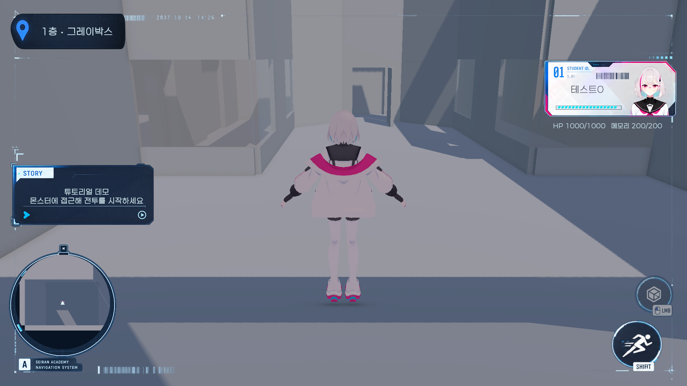
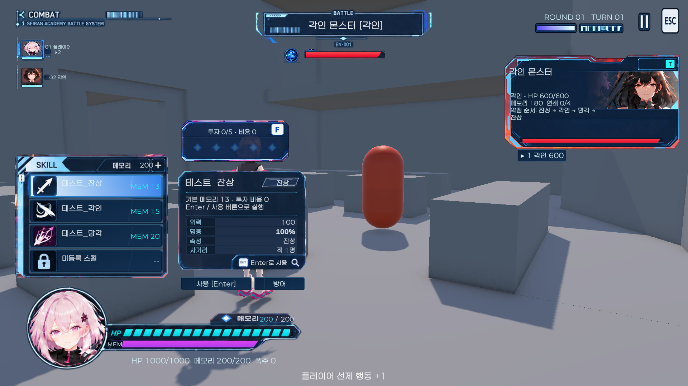

# 기존 UI 에셋 정리

실행 씬은 `Assets/CK_Semester_Project/Prototype/Scenes/TutorialGrayboxingDemo.unity`다. `prototype-ui`의 프레임, 초상화, 스킬 아이콘, 선택/일반 버튼, HP·메모리 게이지 에셋을 재사용한다. 원본 TutorialDemo 씬과 PNG는 보존했다. 새 사각 패널 HUD는 사용하지 않는다.

## 수정 범위

- 기존 Canvas와 UI 오브젝트를 유지하고 주요 패널을 화면 모서리/상단/하단 앵커에 배치했다. CanvasScaler는 1920×1080 기준 Expand 모드다.
- 샘플 이름·수치·가짜 지도·고정 슬롯이 박힌 에셋은 원래 디자인을 기준으로 빈 데이터 영역을 가진 파생 PNG로 편집했다. 원본은 교체하지 않는다.
- 검은 Backdrop과 덮개 생성 코드를 제거했다. 텍스트와 Slider는 에셋의 빈 영역에 표시한다.
- 카드 이름·HP, 층 배너, 투자 비용, 스킬 비용, 적 정보, 메모리 숫자 위치를 정리했다. 실제 Slider와 별도 트랙이 어긋나지 않게 함께 배치한다.
- 행동 순서의 기존 초상화와 강조 프레임을 다시 표시하고, 스킬·방어·대상 버튼에도 기존 버튼 에셋을 사용한다.
- 미니맵을 원형으로 클리핑하고 256×256 텍스처를 재사용한다. 필드에서 최대 10Hz 렌더링, 전투에서 정지한다.
- 편집 PNG의 Unity 임포트는 최대 1024px, mipmap 끔, read/write 끔, 압축 사용이다. PNG 자체를 자르지 않고 투명 여백을 제외한 Sprite rect를 설정했다.

## 데모에서 제거한 조작 UI

- 1층/2층 이동 버튼과 Presenter의 생성·이벤트 참조를 제거했다. 현재 층을 읽어 위치와 배너에 표시하는 연결은 유지한다. 기본 FloorTravelButtons 디버그 UI는 기존처럼 숨겨져 있다.
- 동작이 연결되지 않은 필드 C/J/ESC 메뉴, TAB/R 패널, E 상호작용 아이콘을 Commands 그룹과 함께 제거했다. SHIFT는 아래 달리기 기능에 연결해 복원했다.
- 미니맵은 실제 카메라 표시만 남기고 미연결 Button 컴포넌트를 제거했다.
- 미등록 네 번째 스킬 버튼과 미구현 상세 화면 버튼 오브젝트를 제거했다. 등록된 세 스킬, 투자, 방어, 대상 선택, 전투 종료 버튼은 유지한다.
- 원본 TutorialDemo 씬과 UI 에셋은 그대로 보존했다. 재생성 및 반복 정리에서도 제거 상태를 유지한다.

HUD PlayMode 통합 테스트 7개 통과, 컴파일 오류 0건. 16:9 필드 Game View 캡처에서 삭제 상태와 실제 미니맵·수치 표시를 확인했다.

## 구역 배너와 필드 조작

- 시작 배너는 2.5초 표시하고 1.2초 동안 CanvasGroup alpha를 낮춘 뒤 비활성화한다. 전투에서 필드로 복귀해도 시작 배너는 재표시하지 않는다.
- SHIFT를 누르며 WASD 이동하면 1.8배로 달린다. 기존 달리기 UI 클릭은 달리기 모드를 켜고 끈다. 실제 달리기/토글 상태를 청록색으로 표시하며, 전투 진입 등 이동 비활성화 시 초기화한다.
- 기존 E 버튼을 LMB 버튼으로 바꿔 우측 하단 달리기 버튼 위에 배치했다. 키보드 E는 사용하지 않는다. 기존 좌클릭 선제 전투와 UI가 같은 거리(2.5m)·시야·쿨다운 조건을 사용한다. 주변 대상이 없으면 UI가 비활성화된다.
- 기존 E PNG를 built-in imagegen으로 편집한 파생 파일 `Refined/ui_field_attack_lmb_btn.png`를 사용한다. 원본 PNG와 SHIFT 에셋은 보존했다.
- 7개 PlayMode 테스트로 기존 HUD 연결, 배너 페이드, 달리기 실제 이동 거리와 상태 초기화, 좌클릭 UI 전투 진입을 확인했다. Game View에서 페이드 후 화면 배치를 확인했다.

## 데이터와 도구

게임 규칙과 비용은 기존 TutorialBattleController/BattleSession을 사용한다. PrototypeHudPresenter는 표시와 선택을 담당한다. HP·메모리·현재 층 표시·투자·스킬 비용·대상·행동 순서 데이터 연동을 유지했다. 미구현 상세 화면과 메뉴 기능은 추가하지 않았다.

씬 수정·저장·Play 검증은 Unity MCP로 수행했다. 별도 CK 연결 메뉴는 추가하지 않았다. 기존 Build 단계의 UI 연결 코드에는 동일한 수정 로직을 반영해 재생성 시 덮개가 다시 생기지 않게 했다.

에셋 편집은 built-in imagegen을 사용했다. 파생 에셋과 편집 프롬프트는 [UiAssetEditPrompts.md](UiAssetEditPrompts.md)에 기록했다.

## 검증

Unity 6000.3.23f1에서 HUD PlayMode 테스트 5개가 모두 통과했다: 필드 수치·현재 층 표시와 미구현 조작 제거, 스킬 선택/투자/실행과 비용·피해, 메모리 부족 잠금, 기존 스킬 패널 및 덮개 부재/16:9·4:3·21:9 주요 패널 경계, 미니맵 횟수 제한과 전투 중 정지. 키 힌트의 미지원 글리프를 ENT로 바꾼 뒤 컴파일 및 실제 표시를 확인했다.

실제 Game View에서 16:9 필드·전투와 4:3 필드 캡처로 데이터 표시·슬라이더 위치·패널 겹침을 확인했다. Play 종료/리로드 과정에서 기존 몬스터 NavMesh 정리 오류가 관찰되었으며, 전투 통합 테스트는 통과했다. 전체 튜토리얼 완주와 플레이어 빌드, FPS/GPU 프레임 시간 측정은 수행하지 않았다.

