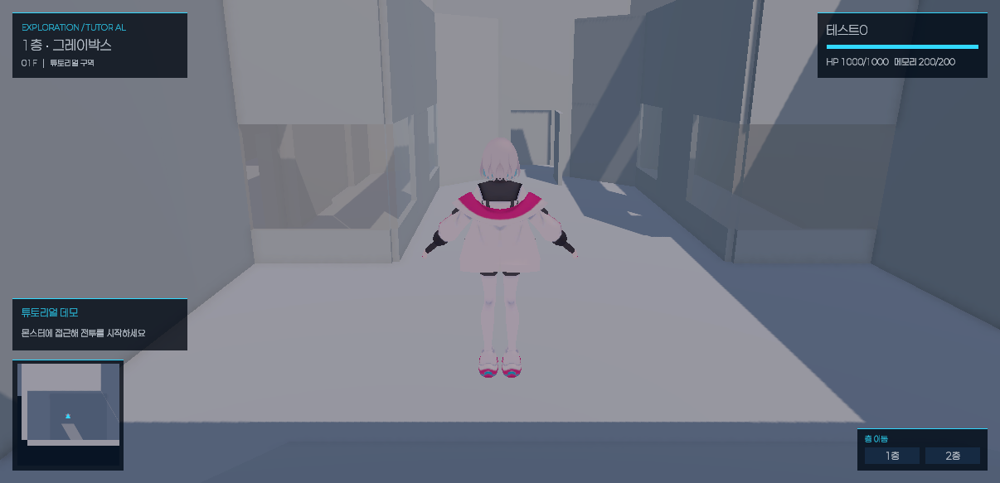
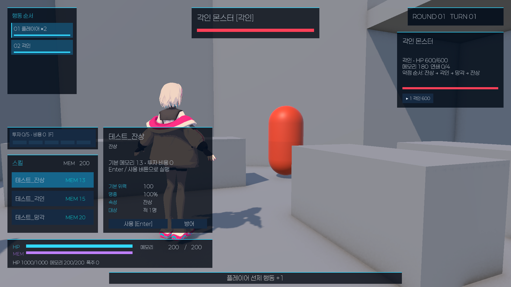

# prototype-ui 기반 데모 HUD

`feat/tutorial-demo-grayboxing`에 `origin/prototype-ui`를 병합했다(722bd01). 실행 씬은 `Assets/CK_Semester_Project/Prototype/Scenes/TutorialGrayboxingDemo.unity`다. UI 브랜치의 TutorialDemo 씬과 그래픽 자산은 원본으로 보관한다.

## 화면 구성과 최적화

데모 HUD는 큰 합성 이미지 대신 uGUI 패널·TMP 텍스트·Slider·Button으로 다시 생성한다. 이미지에 박힌 샘플 글자를 가리는 Backdrop이나 가상 게이지는 사용하지 않는다. 위치·수치·스킬 비용은 실제 데이터로 표시한다. 청색 패널과 청록색 강조선을 사용하고, 동작이 없는 메뉴와 장식 버튼은 데모 화면에서 제외했다.

CanvasScaler는 1920×1080 기준 Expand 모드다. 필드 위치와 플레이어 상태는 상단 모서리, 지도·안내·층 이동은 하단 모서리에 고정한다. 전투는 상단의 행동 순서·대상 정보, 하단의 스킬·상세·투자·플레이어 상태로 구성한다. 화면이 넓어지거나 높아지면 가장자리 기준 여백을 유지한다. 지원 확인 비율은 16:9, 4:3, 21:9이며 세로 모바일 화면은 확인 범위에 포함하지 않는다.

미니맵은 256×256 RenderTexture를 재사용해 필드에서 최대 10Hz로 렌더링하고 전투 중에는 렌더링을 중단한다. HDR·MSAA·오클루전 컬링을 끄고 마지막 결과를 유지한다. HUD의 전투 수치 갱신은 스냅샷·선택·투자·행동 가능 상태가 바뀔 때만 수행한다. 장식과 텍스트는 클릭을 가로채지 않으며 조작 버튼만 입력을 받는다. FPS나 GPU 프레임 시간의 개선량은 측정하지 않았다.

## 데이터 연결

- 필드: Character_DT의 이름, 세션 HP·메모리, 실제 층 이동 상태와 미니맵.
- 전투: 플레이어 HP·메모리·폭주, 대상 이름·속성·HP·약점 순서, 라운드·턴, 실제 행동 순서와 현재 행동자 강조. 추가 행동은 ×2 등으로 표시한다.
- 스킬: Skill_DT 이름·설명·위력·명중·속성·대상과 메모리 비용. 목록 클릭은 선택만 수행하고 사용 버튼 또는 Enter가 행동을 실행한다.
- 투자: 기존 0~5단계와 실제 비용, 메모리 부족 시 잠금·행동 비활성화. F 또는 투자 패널 클릭으로 변경한다.
- 대상 선택·방어·결과 메시지·탐색 복귀와 전투 후 세션 수치 유지.

게임 규칙과 비용 계산은 TutorialBattleController와 기존 BattleSession을 사용한다. 기존 호환 컨트롤은 숨겨서 유지하고, HUD는 PrototypeHudPresenter가 표시한다. HUD 클릭이 필드 전투 진입이나 카메라 잠금으로 이어지지 않도록 기존 UI 입력 제외 처리를 유지한다.

## 재생성

`CK/Tutorial/Connect Prototype UI`는 현재 씬의 Canvas를 새 native HUD로 재생성하고 데이터 참조를 연결·저장한다. Canvas 내부 수동 수정은 재생성 시 교체된다. 맵과 몬스터는 변경하지 않는다. 그레이박스 전체 Build 명령도 같은 생성기를 호출한다. 연속 두 번 재생성해 참조와 중복 생성 여부를 확인했다.

## 검증

Unity 6000.3.23f1에서 컴파일 오류 없이 씬을 저장했다. HUD PlayMode 통합 테스트 5개를 통과했다.

1. HP 731/1000·메모리 143/200 표시와 1층/2층 이동.
2. 선택만으로 턴을 소모하지 않음, 투자 20·스킬 총 비용 35 및 실제 피해, 연출 중 조작 숨김, 취소 후 필드 복귀.
3. 메모리 부족 시 투자 잠금과 실행·방어 버튼 비활성화.
4. 16:9·4:3·21:9에 대응하는 Canvas 크기에서 모든 RectTransform의 화면 경계 및 덮개 부재.
5. 미니맵의 초당 렌더 횟수 제한과 전투 중 정지.

Game View에서 필드·전투 화면도 확인했다. 전체 튜토리얼 완주와 플레이어 빌드 실행은 수행하지 않았다.

