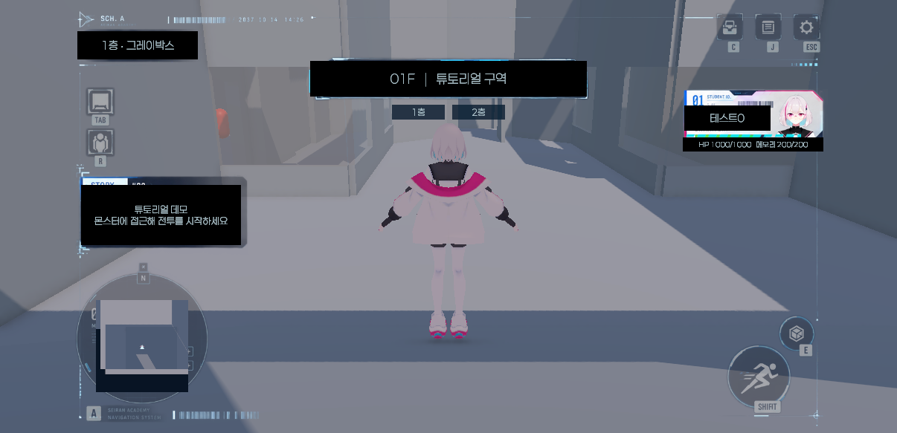
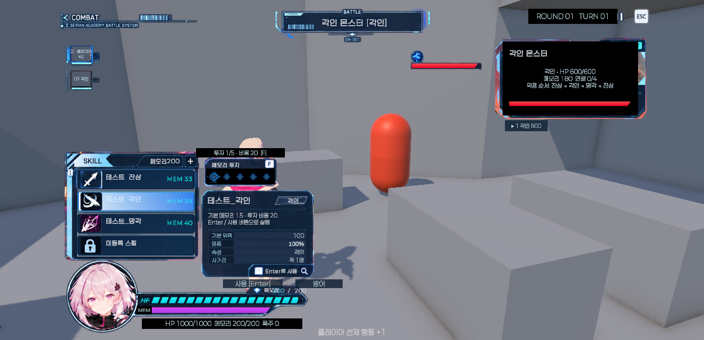

# prototype-ui 데이터 연결

`feat/tutorial-demo-grayboxing`에 `origin/prototype-ui`를 병합했다(병합 커밋 `722bd01`). 실행 씬은 `Prototype/Scenes/TutorialGrayboxingDemo.unity`다. 가져온 TutorialDemo는 UI 원본으로 보관하고 데모에는 그 Canvas를 복제해 사용한다. 첨부 가상 스크린샷의 전투 수치나 이름은 게임 데이터로 사용하지 않았다.

## 연결 범위

- 필드: Character_DT의 캐릭터 이름, 세션 HP·메모리, 실제 층 이동 상태, 현재 층의 실시간 미니맵.
- 전투 기본 HUD: 플레이어 HP·메모리 바와 수치, 폭주 수치, 선택 대상의 이름·속성·HP, 라운드·턴, 실제 행동 순서 및 현재 행동자 강조.
- 선제 진입의 추가 행동은 동일 인물의 중복 카드 대신 `×2`로 표시한다. 1~3기 전투를 위해 최대 네 인물의 슬롯을 준비했다.
- 플레이어 턴: Skill_DT에서 이름·위력·명중·속성·대상·기본 메모리 소모를 가져온다. 스킬 선택은 설명만 갱신하고 `사용 [Enter]` 버튼/Enter로 실행한다. 전투 코어의 비용 및 요청 검증을 그대로 사용한다.
- 투자: 패널 클릭/F로 0~5단계를 순환한다. 실제 초기 메모리를 기준으로 단계별 비용을 표시하고 5개 슬롯의 선택/잠금을 갱신한다. 메모리가 부족하면 사용·방어 버튼이 비활성화된다.
- 대상: 카드 아래 버튼이나 기존 숫자 1~3 키로 변경한다. 대상 HP·메모리·연쇄·약점 순서는 현재 스냅샷을 사용한다.
- 전투 종료: 기존 결과 문구와 필드 복귀 버튼을 새 HUD로 옮겼다. 연출/몬스터 턴 중에는 플레이어 조작 패널을 숨긴다.

현재 코어에는 독립된 SP가 없으므로 원본 SP 바는 `MEM`으로 바꾸고 현재/최대 메모리에 연결했다. 원본의 `3/5`는 실제 메모리 양으로 교체했다. 스킬 투자 단계는 이 수치와 별개로 투자 패널에 표시한다.

UI 원본에는 세 개의 사용 가능한 스킬 자리와 잠금 자리가 있다. 현재 Skill_DT의 세 스킬을 연결하고 네 번째 자리는 비활성화했다. 캐릭터 레벨·별도 SP·스킬 해금·몬스터 저항/내성·웨이브 데이터는 기존 코어에 없으므로 가상 수치로 생성하지 않았다. 대상 정보에는 제공되는 속성·HP·메모리·연쇄·약점 순서를 표시한다.

기존 C/J/Tab/R 메뉴와 달리기/상호작용 이미지에는 UI 브랜치에서도 이벤트가 없었다. 관련 게임 시스템은 이번 데이터 연결에서 새로 구현하지 않았으며, 해당 버튼은 비활성화했다. 필드의 기존 근접 좌클릭 전투 진입은 유지하되 HUD 클릭으로 전투가 시작되지 않도록 UI 위 입력을 제외했다. 층 이동 버튼은 실제 기존 TravelTo와 연결했고 전투 중에는 필드 HUD와 함께 숨겨진다.

## 코드와 재적용

`PrototypeHudPresenter`는 표시와 선택만 담당한다. `TutorialBattleController`에는 스킬/플레이어 데이터, 투자 단계, 대상 ID, 조작 가능 여부의 읽기 프로퍼티와 `GetInvestmentCost`, `SetInvestmentStage`를 추가했다. 기존 API와 직렬화 필드는 유지했다.

`FloorTravelButtons`에 현재 층 및 1층/2층 이동 함수를 추가했다. 데모 인스턴스에서는 디버그 OnGUI 버튼을 숨기고 HUD 버튼을 사용한다. 기존 씬의 기본 표시 설정은 유지한다.

UI 연결 보조 코드는 그레이박스 데모 Build 단계에서 원본 Canvas와 데이터를 연결한다. 별도 Connect Prototype UI 메뉴는 제거했다. Build 재실행은 데모 Canvas의 수동 변경을 교체하므로 일반적인 UI 조정은 현재 씬에서 직접 수행한다.

## 확인

Unity 6000.3.23f1에서 컴파일, 씬 저장 및 UI 참조를 확인했다. 기존 EditMode 169개 및 새 PlayMode 통합 테스트 3개 모두 통과했다. 새 테스트는 실제 데모 씬을 로드해 아래 세 흐름을 검증한다.

1. HP 731/1000·메모리 143/200 표시 및 HUD 1층/2층 이동 버튼.
2. 스킬 선택만으로 턴이 소모되지 않음, 1단계 투자 비용 20 표시, 각인 스킬 실행 시 메모리 35 소비 및 실제 피해, 연출 중 조작 숨김, 취소 후 필드 복귀.
3. 메모리 10에서 5단계 투자 비용 100, 행동 버튼 비활성화 및 투자 잠금.

수동 Play 검사에서도 새 버튼을 통한 스킬 선택·투자·실행과 수치 갱신을 확인했다. 전체 튜토리얼 완주, 실제 키보드/마우스 입력 전수검사 및 빌드 실행은 수행하지 않았다. 미구현 메뉴와 상세 팝업을 포함한 추가 UI 기능은 별도 작업이다.

2026-10-01: 새 사각 패널 HUD로 교체한 515f4ad 변경을 취소하고 기존 prototype-ui 디자인 및 데이터 연결을 복구했다. 이는 화면 비율·덮개 문제의 수정 완료를 의미하지 않는다.
