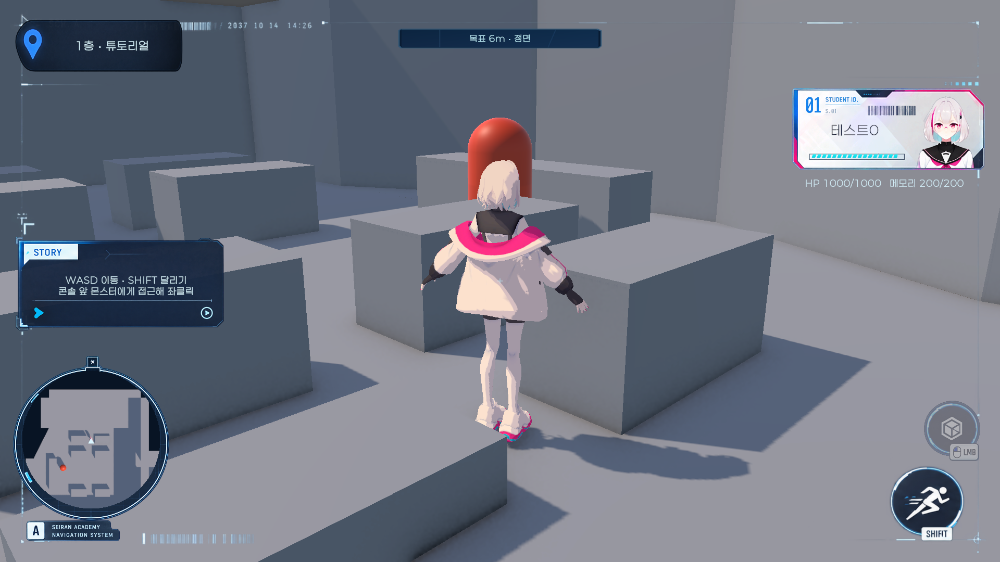
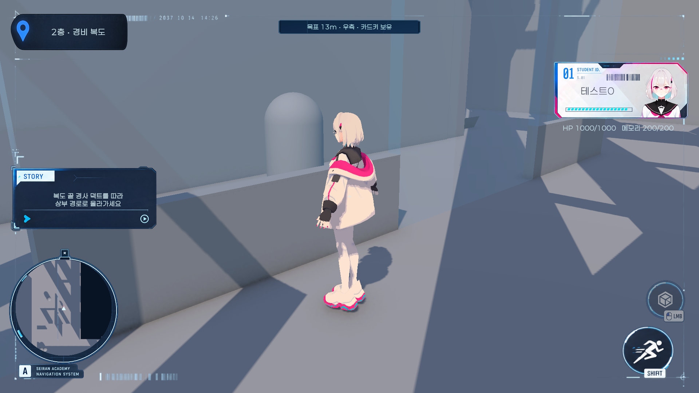

# 그레이박스 튜토리얼 콘텐츠

대상 브랜치: `feat/tutorial-demo-grayboxing`
플레이 씬: `Assets/CK_Semester_Project/Prototype/Scenes/TutorialGrayboxingDemo.unity`

레벨디자인컨텐츠기획서(01)~(04) v0.2를 기준으로 기존 그레이박스 지형과 전투·필드 UI를 연결했다. 원본 맵과 UI PNG는 보존한다. Unity MCP에서 씬 연결·저장·플레이 검증을 수행했다.

## 플레이 순서

1. 캡슐 시작 연출이 끝나면 WASD로 이동한다. SHIFT 또는 기존 달리기 버튼으로 달린다.
2. 콘솔 앞 경비병에게 접근해 좌클릭으로 전투를 시작한다. 첫 전투 승리 후 카드키를 얻는다.
3. 출입문과 엘리베이터 앞 문을 바라보며 좌클릭한다. 복도를 따라 카에 탑승한 뒤 패널을 좌클릭한다.
4. 실제 카와 탑승자가 함께 하층으로 이동한다. 도착 문이 열리면 유리 복도로 이동해 경비를 관찰한다.
5. 복도 끝 열린 옆길을 지나 경사 덕트를 올라간다. 상부에서 소음과 경비 AI의 반응을 관찰한다.
6. 다음 덕트 구간이 한 번 붕괴한다. 바닥 충돌이 해제되어 중력으로 착지하며, 낙하 소음에 경비가 반응한다.
7. 홀 출입문을 열고 적 순찰을 피해 홀 끝 계단을 오른다. 상층 문을 열고 출구를 통과하면 완료된다.

카드키가 없거나 앞 단계를 통과하지 않으면 문/진행이 잠긴다. 전투 패배 또는 맵 아래 낙하 시 최근 체크포인트로 복귀하며 카드키·열린 문·붕괴 상태를 유지한다. 연출/엘리베이터/관찰 중 자동 전투 진입을 막는다.

## UI

기존 STORY 패널은 현재 단계의 목표를 표시한다. 추가한 것은 기존 스킬 버튼 PNG를 배경으로 사용한 목표 거리·방향·카드키 표시, 좌클릭 상호작용 안내, 잠금/획득/도착/붕괴/완료 안내와 TMP 조준점이다. 전체 화면 이미지 덮개는 추가하지 않았다. 기존 LMB 버튼으로 문·패널 또는 선제 전투를 실행한다.

위치 표시는 실제 상층/하층 높이와 현재 구역을 읽는다. 시작 구역 배너의 페이드, HP·메모리·미니맵·전투 UI 연결은 유지한다. 16:9·4:3·21:9에서 주요 패널의 화면 경계를 자동 검증했다.

## Inspector 조절 위치

- `Tutorial Level Content / TutorialLevelFlow`: 시작 2초, 엘리베이터 7초, 관찰 3초, 붕괴 0.8초, 낙하 소음 반경 12m와 진행에 필요한 참조.
- 각 문과 엘리베이터 패널의 `TutorialFieldInteractable`: 행동 종류, 상호작용 거리 2.6m, 문 개폐 시간 1초, 이동량.
- `Tutorial Battle / TutorialBattleController`: 걷기 소음 3m, 달리기 소음 8m, 기존 전투 설정.
- 각 몬스터의 `EnemyStateMachine`: 순서대로 순찰하는 `Patrol Points`, 시야·청각·정지 시간 등 기존 행동 수치. 경비는 두 순찰 지점을 왕복한다. 지점 배열이 비어 있으면 기존 무작위 순찰을 사용한다.
- `TutorialFirstEncounter.asset`: 첫 전투 전용 임시 HP 240·공격력 25. 원본 몬스터 데이터와 후속 전투 수치를 변경하지 않았다.

원본 지형의 막힌 임시 칸막이를 데모에서 올리고 복도 끝 바닥 틈과 상층 출구 착지면을 연결했다. 경비 복도의 기존 창 패널은 투명 재질을 사용하되 물리 충돌은 유지한다.

## 검증과 범위

Unity 6000.3.23f1 PlayMode 테스트 **11개 통과, 실패 0개**.

- 실제 첫 전투 승리 → 카드키 → 문 개폐 → 탑승자와 카 동시 이동 → 순서별 트리거 → 실제 덕트 낙하 → 출구 완료.
- 첫 문 이후 텔레포트 없이 CharacterController로 복도·엘리베이터·덕트·홀·계단·출구까지 이동해 지형 연결을 확인.
- 실제 경비 AI의 SoundLook 반응, 순서 건너뛰기 차단, 체크포인트 복귀와 카드키 유지.
- 기존 HUD 수치·층 표시·배너·달리기·좌클릭 전투·스킬 비용·메모리 잠금·화면 비율·미니맵.

Game View에서 시작 화면과 하층 안내 UI를 확인했다. 하층 캡처는 화면 점검을 위해 런타임 진행 상태를 이동한 예시이며, 실제 이벤트 검증은 위 통합 테스트로 수행했다.

현재는 그레이박스 기능 버전이다. 캡슐 개방/덕트 붕괴는 기존 메시 이동으로 표현하고, 경비 대사는 텍스트 안내다. 음성·최종 연출/애니메이션·환경 아트·정식 밸런스는 포함하지 않는다. 기획서의 목표 플레이 시간은 사람의 전체 플레이로 측정하지 않았으며 플레이어 빌드 검증도 수행하지 않았다.

